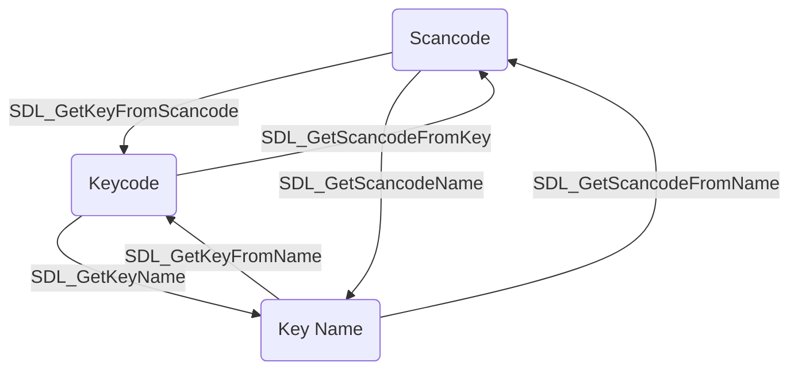

除了事件里面可以处理按键，SDL2还专门提供了SDL_keyboard.h, SDL_keycode.h, SDL_scancode.h三个文件来对按键进行操作。
<!--more-->
***
**三个枚举类型**
这三个枚举类型在事件处理里面已经见过了:
* [SDL_Keycode](http://wiki.libsdl.org/SDL_Keycode?highlight=%28%5CbCategoryEnum%5Cb%29%7C%28CategoryKeyboard%29)：按键码
* [SDL_Keymod](http://wiki.libsdl.org/SDL_Keymod?highlight=%28%5CbCategoryEnum%5Cb%29%7C%28CategoryKeyboard%29)：附加按键（Shift,Alt,Ctrl之类的）
* [SDL_Scancode](http://wiki.libsdl.org/SDL_Scancode?highlight=%28%5CbCategoryEnum%5Cb%29%7C%28CategoryKeyboard%29)：按键码


**一个结构体**
这个结构体也是记录按键键码的：
[SDL_Keysym](http://wiki.libsdl.org/SDL_Keysym?highlight=%28%5CbCategoryStruct%5Cb%29%7C%28CategoryKeyboard%29)
其实这个结构体里面只是封装了SDL_Keycode,SDL_Keymod,SDL_Scancode三个枚举类型。
***
**Scancode,Keycode和按键名称之间的转化**
_其他两个到Scancode_
```c++
SDL_Scancode SDL_GetScancodeFromKey(SDL_Keycode key)
SDL_Scancode SDL_GetScancodeFromName(const char* name)
```

_其他两个到Keycode_
```c++
SDL_Keycode SDL_GetKeyFromName(const char* name)
SDL_Keycode SDL_GetKeyFromScancode(SDL_Scancode scancode)
```

_其他两个到按键名称_
```c++
const char* SDL_GetKeyName(SDL_Keycode key)
const char* SDL_GetScancodeName(SDL_Scancode scancode)
```

也就是说存在下面的关系:


**获得/设置Keymod**
```c++
SDL_Keymod SDL_GetModState(void)
void SDL_SetModState(SDL_Keymod modstate)
```

***
**获取键盘状态**
_获得焦点窗口_
```c++
SDL_Window* SDL_GetKeyboardFocus(void)
```

_获得键盘按键_
```c++
const Uint8* SDL_GetKeyboardState(int* numkeys)
```
这个函数返回一个Uint8的数组。这个数组里面装载着对应Scancode的按键。如果为1代表按下了，比如检测w是否按下：
```c++
Uint8* keyarr = SDL_GetKeyboardState(nullptr);
if(keyarr[SDL_SCANCODE_W]==1)
    SDL_Log("w is pressed!");
```
传入的参数numkeys代表要获得多少个按键的状态。如果为NULL的话就是全部按键。
***
**其他函数**
_屏幕的虚拟键盘开启了吗_
```c++
SDL_bool SDL_IsScreenKeyboardShown(SDL_Window* window)
```

_系统支持虚拟键盘吗_
```c++
SDL_bool SDL_HasScreenKeyboardSupport(void)
```
