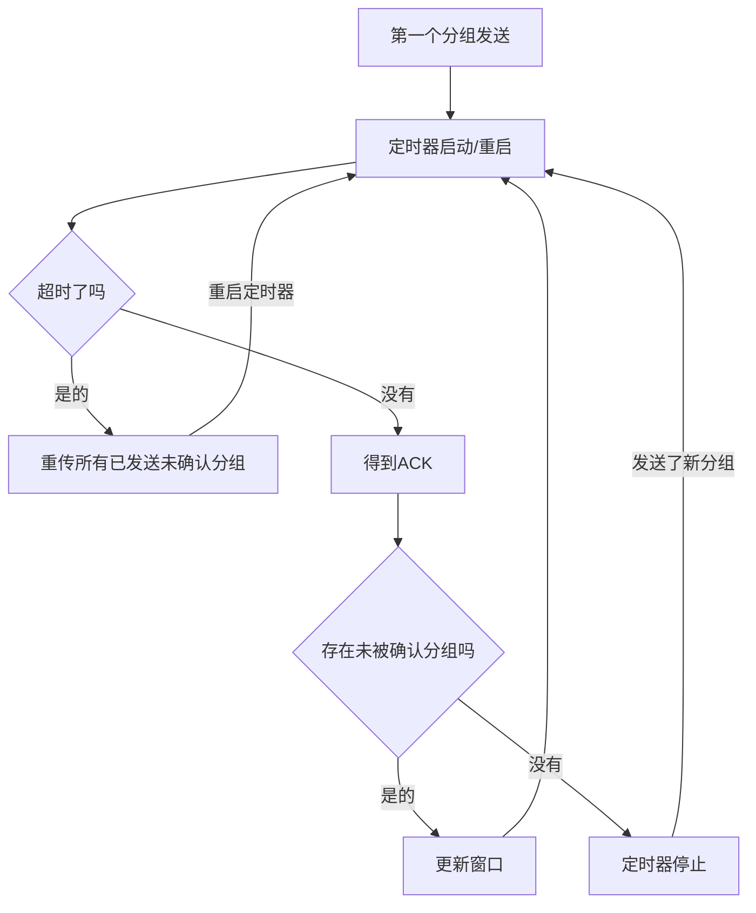

《计算机网络：自顶向下方法》的学习笔记。

运输层是只工作在端系统的层，用于将应用程序的网络消息传输到网络边缘，以及从网络边缘得到数据并发送给应用程序。

运输层的中点是TCP和UDP协议，重点中的重点是TCP协议。

如果你想要详细了解TCP，UDP以及网络层的IP，ICMP协议的话，强烈推荐你去看《TCP/IP详解：卷一》

<!--more-->

# 运输层的主要作用

运输层和其下的网络层，虽然看上去很像，但功能并不一样。运输层的特点是：

* 只运行在端系统，也就是只运行在主机，在路由器，调制解调器等中继器件上是不支持的。
* 用于将数据从应用程序移动到网络边缘。

而网络层则是运行在路由器等硬件上。每次运输层将应用程序想要发送的信息移动到网络边缘，然后由网络层传输数据到另一个主机，然后运输层再从网络边缘将数据移动到另一个主机上的应用程序，完成一次数据传送。

运输层是通过Socket套接字和应用程序交互数据的，而网络层则不能感知到套接字。

比如你现在通过浏览器上百度，首先浏览器会使用HTTP协议生成一个数据包，然后网络层将这个数据包发送到无线网路由器或者调制解调器（取决于你联网的设备），然后运行在路由器和调制解调器（主要是路由器）上的运输层通过一系列算法将数据传向下一个路由器，一直传到搭载百度HTTP服务器的主机上，然后网络层再从路由器或调制解调器将数据搬运到百度HTTP服务器端，完成一次请求。

而且网络层只会作用于网络层报文段，是不会检查运输层报文段的。

运输层提供了不同主机上进程的逻辑通信，而网络层则是提供了不同主机之间的逻辑通信。

# 运输层的主要协议：TCP和UDP

## 协议概述

运输层主要是TCP和UDP协议。TCP协议的特点是：

* 面向连接的服务。通信双方每次通信都得建立连接，如果连接不能建立，那么是无法传送数据的。
* 全双工的连接。你可以通过一条连接发数据给我，我也可以通过同样一条连接发送信息给你。
* 可靠的连接。TCP通过一系列手段保证数据可靠地传输到目标地点。

而UDP简直是TCP的对立面，其特点是：

* 面向流的（无连接）服务。通信双方不需要建立连接，发送方想什么时候发信息就发信息，而不管接收方是否在接受信息。
* 不可靠服务。UDP完全不管你的数据是否正确送到了，它只管发送。

虽然UDP看上去很废柴，但是UDP的效率很高。TCP为了维护可靠的连接，首先得进行三次握手建立连接，还要通过窗口，定时器等一系列操作保证数据传输，所以会很费时间。TCP用在HTTP协议，网络游戏等。而UDP则用于实时通讯，语言交流等对延时要求很高的程序。

这里需要注意的是：TCP的可靠连接是TCP自己的能力，丝毫不依赖下层（运输层和链路层）。因为在运输层的IP协议是一个“尽力交付”协议（也就是不可靠的）：我尽力将数据传送到，但是到底能不能传送到就不是我的事情了。而TCP在运输层通过很多方法来确保可靠，和IP协议完全无关。

## 多路复用和多路分解

TCP和UDP从网络层拿到数据之后不是直接给应用程序，而是给应用程序生成的套接字。那么**将运输层报文段中的内容交付到正确的套接字的工作就是`多路分解`**，而相反，**将套接字生成的数据附上首部信息，并且移动到网络层的工作就是`多路复用`**

## UDP协议

UDP的特点使得UDP拥有如下优点：

* 应用程序可以更加精细地控制数据发送的时机和内容。因为UDP接收到数据之后就送出去了，而没有TCP繁琐的操作。
* 无需建立连接。UDP可以更快地发送数据
* 无连接状态。由于TCP需要保持可靠连接，所以需要一些内存来保存信息。而UDP则不需要
* 分组首部开销小。UDP的首部只有8字节，TCP则有20字节。

### UDP报文结构


长度是指**包括首部和数据的UDP数据报的长度**。校验和是是接收方用来检验数据是否出错的信息。

#### 校验和（Check Sum）

UDP提供了差错检测功能，可以通过校验和来得知接受的数据是否出错。具体算法是**所有信息（除了校验和）分为16比特一组（少的补0），将所有的组全部加起来，溢出的位回卷，然后取反码**。

所谓回卷就是将溢出的位和第一位相加。

比如我现在要传一个空信息到百度（数据部分为空）：

```bash
源端口号:8080 = 00011111 10010000
目标端口号:80 = 00000000 01010000
长度:8字节 =    00000000 00001000
```

那么三个加起来是`0001111111101000`，然后取反码，就得到校验和`1110000000010111`。

校验的方法就是将校验和和所有数据（除了校验和）加起来，如果全为1代表没有出错，有一个0就是出错了。

虽然能够检测出差错，但是UDP不能恢复错误。

## TCP协议

TCP是面向连接的可靠数据传输协议。

### TCP报文段结构

为了下面的知识点，需要先看一下其段结构：


序号是TCP协议用来区分报文的。如果报文非常大，TCP会将报文分段，然后给每段一个序号，到时候传到目的地，目标再通过需要将包重新组合回报文。

确认号是在三次握手，四次挥手以及收到消息之后所发送的。

需要注意的是第四行中的`CWR，ECE`等位，RST，SYN，FIN用于连接的建立和断开，PSH表示接收方应该立刻将分组送往程序，ACK用于指示确认号是有效的，CWR和ECE用于拥塞控制中。

紧急数据指针是在此数据报被视为紧急数据（URG位为1）的时候使用的。

选项是针对TCP的一些选项（详情见《TCP/IP详解：卷一》）

#### 序号和确认号

序号**并不是一系列连续的数字，而是根据分段大小递增的数字**。也就是说，我发送的第一个分段的大小是1022字节，那么我第一个分段的序号就是0，而第二个分段则是1023。

确认号也不是连续底层的数字，而是**接收端期望从发送端收到的下一字节的序号**。也就是说假设发送端发送了序号为200，大小为1022字节的数据，那么接收端返回的确认号应当是1022+200+1=1223。简单来说就是**接收到的序号加1**。

### 建立连接的三次握手和断开连接的四次挥手

#### 三次握手

要想使用TCP传输数据，必须先建立连接。TCP建立连接的方法是三次握手：

```bash
客户端                    服务器端
|[SYN] SEQ=n len=x           |
|--------------------------->|
|                            |
|[SYN] SEQ=x+1 ACK=n+1  len=y|
|<---------------------------|
|                            |
| ACK=m+1 SEQ=y+1            |
|--------------------------->|
```

客户端首先发送一个SYN报文给服务器端，并且带有自己的序号和数据长度。

然后服务器端接收到之后，返回一个包含ACK的SYN报文给客户端。

然后客户端再次发送一个报文给服务器端，经理了这三次数据传输之后，连接就建立了。

简单来说就是：客户端首先发送SYN表示我要建立连接了，然后服务器端为了表示收到，发送一个报文回去（其中ACK表示收到上个报文，SYN表示想要建立连接），然后客户端返回一个带有ACK的报文表示我知道你同意并也想要建立连接了，那我们两个就建立连接吧。

这里的SYN报文就是将SYN位设为1的报文。含有ACK的报文就是将ACK位设置为1的报文。

接下来来看一下实际的三次握手，这里使用`wireshark`抓包工具捕获telnet连接到百度HTTP服务器时的三次握手：


看Info那一栏：telnet先发送了带有SYN设置的TCP包给百度，并且Seq是0，数据的长度也是0。

然后百度返回了一个带有SYN设置的TCP包，并且Ack=1，Seq=0，长度为0

然后我方再返回一个ACK=1，SEQ=1的包，握手完成。

#### 数据传输

数据传输的过程中，每当接收方收到分组的时候，都需要返回一个含有ACK的报文，表示我已收到，并且这个ACK的值就是接收报文序号的值加1。这里直接看一个例子：


这里通过telnet连接到QQ的POP3邮箱服务，并发送一些信息。

前三行是照旧的三次握手，第四行服务器那边发来了“+OK XMail POP3 Server v1.0 Service Ready(XMail v1.0)”字符串，于是telnet在第五航返回了一个ACK表示已经收到信息。然后第六行我利用telnet发送了"user VisualGMQ"的字符串过去，在第七行服务器返回了一个ACK表示收到，并且紧接着在第八行发送了“+OK”的消息回来，我们的telnet也不能失礼，直接在第九行返回了代表确认的ACK。

#### 四次挥手

当我们想断开连接时，我们需要通过四次挥手来告诉对方。四次挥手的过程如下：

```text
客户端                    服务器端
|[FIN]                       |
|--------------------------->|
|                            |
|                      [ACK] |
|<---------------------------|
|                            |
|                      [FIN] |
|<---------------------------|
|                            |
| [ACK]                      |
|--------------------------->|
```

这里忽略了SEQ的值，反正计算都一样。

一般都是由客户端发起中断连接的请求，所以这里客户端发送设置为FIN的报文给服务器。服务器得到之后，表示我已经知道你要断开连接了，所以返回了一个ACK。

这个时候要注意：**连接并不是在这个地方就彻底断开了**。由于TCP是全双工连接，客户端发送FIN只代表客户端通向服务器的连接断开了，也就是说客户端不能向服务器发送数据了，但是服务器到客户端的连接还没断开呢，客户端这个时候还能接收数据，所以客户端程序也不是在发送ACK之后就关闭了，而是要等待服务器端的FIN。

接下来服务器端发送了一个FIN，表示我也要断开和你的连接了，客户端表示OK，返回了一个ACK。至此，服务器和客户端的连接才真正断开了。

有些时候为了省事，FIN和ACK会一起被发出：

```text
客户端                    服务器端
|[FIN]                       |
|--------------------------->|
|                            |
|                 [ACK] [FIN]|
|<---------------------------|
|                            |
| [ACK]                      |
|--------------------------->|
```


为了更详细地弄清楚在四次挥手时客户端和服务器的状态，给出下图：


可以看到，客户在得到ACK之后并没有直接CLOSE，而是进入了FIN-WAIT-2状态。这个状态下客户端只能接受来自网络的数据，它也是在等待可能来自服务器的数据。而且在接收到对方的FIN并且返回ACK之后，还会等待2MSL时间才会关闭。MSL（MAX Segment Life最长报文寿命），是任何报文在网络上能存在的最长时间。

最后给出一个实例，是通过telnet连接到QQ的POP3服务器断开的情形（倒数四行是四次挥手）：


#### 总结大图

最后将握手，通讯，挥手三部分的总图给出来，图片来自于《UNIX网络编程：卷一》：


你自己细品🍵

### 提供可靠连接的方法

接下来要说TCP的重难点：TCP究竟是如何只靠自己就提供了可靠连接的呢？

TCP是靠如下方法提供可靠连接的：

* 校验和：用来确保数据的正确性
* 序号：用于将乱序的信息重新排序
* 确认：告诉对方已收到报文
* 否定确认：告诉对方收到**错误的报文**（注意不是没收到报文），对方会重传
* 定时器：在一定时间内没有接受到相应ACK会判断丢包，可能重传
* 窗口和流水线：提高发送和接收效率

#### 校验和

这个就不多说了，和UDP一样，需要校验和来确保数据的正确性。

#### 序号

由于网络和分组传递路径长短的问题，到达的分组可能是乱序的，这样给每个分组一个序号，就可以通过序号将分组重新组合成原有的报文。

序号还有一个作用：避免冗余分组。假设A向B发送了一个分组，过了一段时间之后A觉得时间太长了（定时器到了），以为分组已经凉凉，会重发一个分组。但是这个分组其实并没有凉，而是完好无损地发给了B，只不过时间长了一点。那么这个时候B就可能接收到两个一样的分组。有了序号我们就可以辨别同样的分组（SEQ值一样），然后丢弃冗余分组了。

#### 确认和否定确认

当收到分组的时候会返回一个确认报文（ACK报文），如果没有接收到正确的分组会返回一个否定确认报文（称为NAK报文），表示我收到错的分组。这个时候发送方会选择**重传**（就是将丢掉的分组再传一遍）。

实际上TCP报文段中并没有对NAK报文的设置位，TCP发送的其实是ACK。因为首先你接收到了正确的分组，发送了一个ACK，然后检查了一下发现这个分组是错的，再针对这个分组发了个ACK。接收方一看：你怎么对同一个分组发了两个ACK（第二个ACK称为冗余ACK），肯定是什么地方搞错了，所以他也会重传。

#### 定时器

定时器分为四种：`重传定时器`，`坚持定时器`，`保活定时器`，`2MSL定时器`。这里介绍重传定时器，其他定时器在其他部分介绍。关于定时器的底层机制，见《TCP/IP详解：卷一》。

重传定时器，顾名思义，当这个定时器到时间了会触发分组重传。每次发送方发送一个分组都会为这个分组启动一个定时器，等到定时器到了还没有收到对应ACK的话就会重传，收到则会终止定时器。

#### 流水线和窗口

在存在前面所说的机制之后。TCP仍然存在一个严重缺陷：当TCP发送一个分组之后，他得启动定时器，等待分组到达目的地，然后得到ACK之后关闭定时器，再发送下一个分组。这显然是一个很浪费时间的事情（这种协议被称为**停等协议**）。聪明的小伙伴一定一眼就看出解决办法了：用缓冲区啊！没错。流水线其实就是在TCP中加入了缓冲区，而窗口则是管理缓冲区的一种算法。

##### 回退N步（滑动窗口）和选择重传

###### 滑动窗口协议

回退N步协议又称滑动窗口协议（GBN）。在GBN协议中，发送方可以一次性发送多个分组而不必等待ACK。其会将所有的分组排成一列（称为流水线），并且根据以下方法来管理


最右边的纯黑色分组是目前还不能用的分组，绿色的是可用的，但是还没发送的分组。灰色是已经发送了，但是还没有接收到对应ACK的分组，深灰是已经被确认的分组。

滑动窗口协议维护两个变量：base和nextseqnum。整个窗口的长度为N。而发送了还未确认的分组存在于$[base, nextseqnum-1]$，可用未发送的存在于$[nextseqnum, N+base-1]$中。小于base的为已确认分组，大于$N+base-1$的为不可用分组。

如果这个时候发送方的第一个分组得到了其ACK，那么窗口会向后移动一格，这样就会多一个可用分组了。这也就是为什么叫做滑动窗口的原因：


如果位于`base`处的分组收到了ack，那么他会变为已确认分组，`base`的值将加1来使窗口向后滑动。

如果接收方接收到了序号为n的分组，且这个分组是有序的（也就是说前n-1个都接收到了），那么接收方会针对这个分组返回一个ACK。如果不是有序的，接收方会**丢弃这个分组，让发送方重传**。这种确认方式叫做**累计确认**。

如果程序现在要发送分组，运输层会先看窗口是否已经被“发送但未确认分组”塞满了，如果塞满了，网络层将不给予发送（也有可能会将分组缓存，等到窗口有空间了再发送），如果窗口内存在“可用未发送分组”，那么取出`nextseqnum`处的可用分组，填充数据之后发送，并且更新`nextseqnum`变量。

整个窗口维护**一个**重传定时器。这个定时器在最早的分组发送时生成。如果出现超时，发送方会重传**所有发送但未确认分组**（这也是回退N步名称的由来）。如果还未超时时已经接收到了ACK，并且存在发送未确认分组，那么定时器重新计时；如果不存在发送未确认分组，定时器停止：



###### 选择重传

可以看到滑动窗口中的一个大缺陷：接收到的分组必须是连续的，如果不是连续的就直接丢弃。这样是很浪费带宽的。选择重传顾名思义，就是接收方接收到不连续的分组时，仅仅对这个分组发出重传要求。这样可以节省贷款，但是增加了运行时内存。

相比于回退N步，选择重传协议需要为每一个分组开启一个定时器，定时器到了之后重传这个分组而不是所有分组。下面是选择重传的发送方和接收方示意图：


发送方会保留已发送分组在窗口内，只有当`base`处的分组接受到之后，窗口才会向后滑动多个分组（这里就是3个）。接收方也是一个道理。

### 往返时间估计和超时

TCP在发送报文的时候会设定一个定时器，那么这个定时器应当定多长时间呢？

首先定时器时长必定要大于一个**RTT**（Round Trip Time），RTT是报文传输到获得此报文ACK之间的间隔时间。TCP有公式可以计算出设定的时长。

首先TCP会**间断地测量一个报文的RTT**，这个RTT称为`SampleRTT`。注意**TCP绝不会对重传报文测量SampleRTT，也就是说报文必须是一次性到达的才能测量**。

然后TCP会维护一个`EstinamtedRTT`，用于估算SampleRTT的均值，此值为
$$
EstinatedRTT=(1-\alpha)EstinmatedRTT+\alpha SampleRTT
$$
其中$\alpha$的推荐值为0.125。

然后还会维护一个`DevRTT`用于估算SampleRTT偏离EstimatedRTT的程度，为
$$
DevRTT = (1-\beta)DevRTT+\beta|SamplerRTT-EstimatedRTT|
$$
$\beta$的推荐值为0.5。

最后就可以推算出重传超时间隔`TimeoutInterval`:
$$
TimeoutInterval = EstimatedRTT+4DevRTT
$$
推荐的`TimeInterval`初值为1秒。**当出现超时时`TimeoutIntercal`会加倍**。然而只要收到ACK或者来自Socket的数据时，就需要用上述公式再次计算。

### 快速重传

定时器虽好，但可能计时时间很长，这样会让报文的重传时间变慢。基于此，如果TCP收到了三个冗余ACK（即先收到一个ACK，然后收到三个和先前一模一样的ACK），TCP就会执行快速重传，即在该报文定时器过期之前就重传该报文。

### 流量控制

TCP可以自己控制流量。如果发送方不停地发送数据，而接收方在忙其他数据的话，接收方的缓冲区将会溢出，然后接收方要求重传，这就导致了发送包的浪费。TCP通过报文段的`接收窗口`（rwnd）字段来告知对方我的缓冲区当前大小。发送方每次发送的分组不得大于接受窗口的大小。

### 拥塞控制

如果过个TCP同时以较大的速度发送分组，那么网络会拥塞，导致大量分组丢失，然后由于重传机制导致更多的分组发出，网络更加拥堵。

为了防止上面的情况发送，TCP还可以预防网路拥塞，主要是通过在发送方维护一个`cwnd`变量来预防拥塞。发送方发送的数据不能超过$\min\{cwnd, rwnd\}$具体通过三种方法：

* 慢启动
* 拥塞避免
* 快速恢复

#### 慢启动

在慢启动状态下，cwnd以一个**MSS**（Max Segment Size TCP能够传输分组的最大长度）开始，每次收到一个ACKcwnd就再加一个MSS。

慢启动虽然看上去一开始很慢，但是增长的速度是惊人的。一开始$cwnd=1$，能够发送一个分组，发送之后得到ACK，$cwnd=2$就可以发送两个分组了，然后会得到两个ACK，$cwnd=4$...这样是以指数方式增长的。

当需要重传时，TCP会记录下当前cwnd值的一半（记为`ssthresh`），然后将cwnd再次置为一个MSS，并且再次执行上面的递增方法。如果遇到三个冗余ACK，则会进入**快速恢复**（下面会说）算法

#### 拥塞避免

当cwnd超过ssthresh时，cwnd会进入拥塞避免算法，这个时候每一个RTT时间后会使cwnd会以一个MSS的速度线性增长，直到遇到重传，会再次开始慢启动算法。

#### 快速恢复

这是TCP推荐的算法，而不是必须的。当接收到三个冗余ACK后会进入这个算法，主要是将ssthresh和cwnd调整为当前窗口的一半，然后继续执行拥塞控制算法

#### 总结图

图片来自于[csdn博客](https://blog.csdn.net/qq_41431406/article/details/97926927)：


